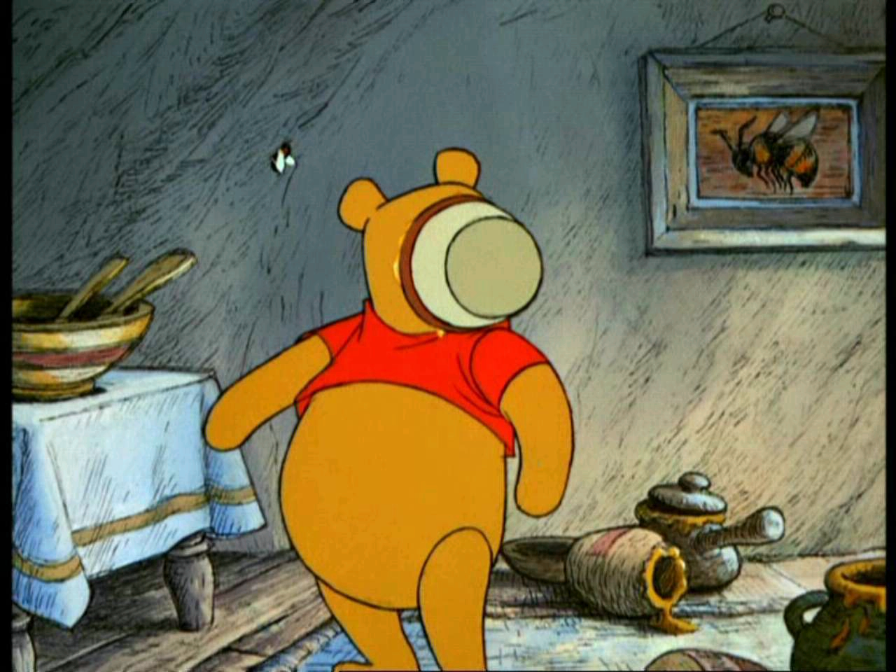
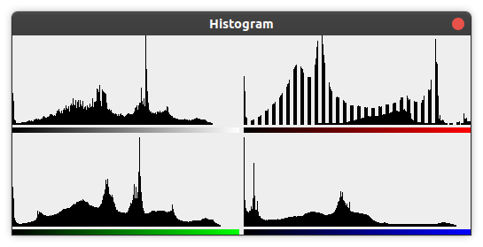
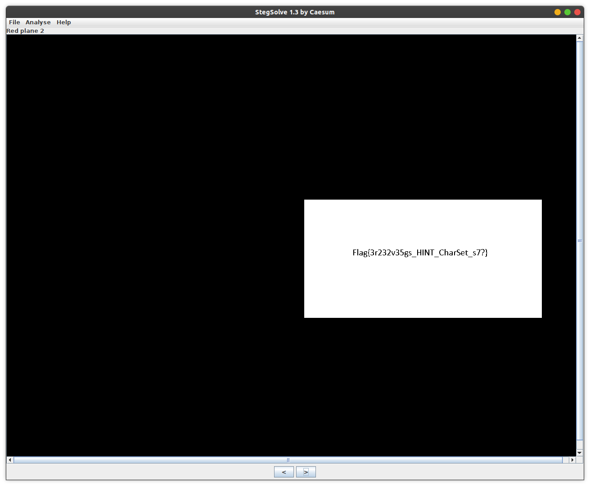
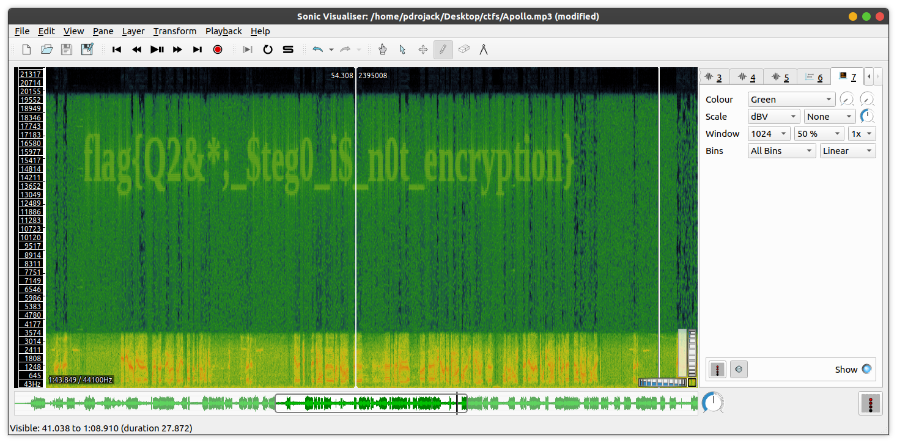

##  Rowdy Hacks 2021 CTF

Hey Everyone This is pdrojack. I participated in RowdyHacks 2021 hackathon CTF and decided to write my experience.

----

* Difficulty: Easy
* Type: Steganography, Password Cracking, Audio Steganography
* Tools: Hashcat, binwalk, xxd, strings, 7zip
* Problem: CTF was divided into two parts:
    * In the 2nd part, we have to crack the password of Apollo.7z file and then we have to get the flag from extracted Apollo.mp3 file.

----

## Part 1

In the 1st part, we were given three image files and have to find three flags in total from these files. These flags are hints to get the password of a 7z file named Apollo.7z, which contains the part 2 of the ctf.

Three image files were:

    - EmployeeOfTheMonth.jpg
    - Suetonius.jpg
    - HoneyPot.png

Lets investigate, EmployeeOfTheMonth.jpg:

Using the file command on the file: 

    file EmployeeOfTheMonth.jpg

I got the output

    EmployeeOfTheMonth.jpg: JPEG image data, JFIF standard 1.01, resolution (DPI), density 72x72, segment length 16, comment: "RG9udCBQYW5pYw==", baseline, precision 8, 1920x1280, components 3

Hmmm, Everything seems normal except there is a comment string in the metadata, "RG9udCBQYW5pYw==". A pretty easy guess would be a base64 string (Two equal signs at the end of the string). Using a base64 decoder I got the output: 

    $ echo RG9udCBQYW5pYw== | base64 -d
    Dont Panic

Dont panic !!! Okay so we got another string but in human readable form this time. Lets just keep it here on the table, maybe it will come in handy later.

Then I used steghide to see if there are any hidden files in the EmployeeOfTheMonth.jpg using "Dont Panic" as password.

    $ steghide extract -sf EmployeeOfTheMonth.jpg                 
      Enter passphrase: 
      wrote extracted data to "hidden.txt".

Bingo!! There is some hidden text. Lets see what we got:

    $ cat hidden.txt
    flag{M5#t7k&&00h4_HINT_PW_LENGTH_15}

Okay so we got our first flag and it also contains a HINT, which says that the password length is 15. Hmmm, 15 what ? apples ? bananas ?. Okay enough with the teacher jokes, password is 15 characters long.

Now lets move on to second file, Suetonius.jpg. 

As usual lets binwalk this file: 

    $ binwalk Suetonius.jpg
    DECIMAL       HEXADECIMAL     DESCRIPTION
    --------------------------------------------------------------------------------
    0             0x0             JPEG image data, JFIF standard 1.01
    320           0x140           7-zip archive data, version 0.4
       
Alright, binwalk found something. With careful and thorough investigation using advanced artificial intelligence, I think there is a 7zip file hidden in this jpg file. Lets extract it

    $ binwalk -D='.*' Suetonius.jpg                               (base) 21:04:31

    DECIMAL       HEXADECIMAL     DESCRIPTION
    --------------------------------------------------------------------------------
    0             0x0             JPEG image data, JFIF standard 1.01
    320           0x140           7-zip archive data, version 0.4

In the extracted directory, there are two files.

    $ ll                                                          (base) 21:05:52
    total 800K
    -rw-rw-r-- 1 pdrojack pdrojack 400K Apr  4 21:04 0
    -rw-rw-r-- 1 pdrojack pdrojack 399K Apr  4 21:04 140

File named "0" is the original image but file named 140 is a 7zip file.

    $ file 140                                                    (base) 21:07:21
    140: 7-zip archive data, version 0.4

Lets extract it.

    $ 7z e 140                                                    (base) 21:07:53
    7-Zip [64] 16.02 : Copyright (c) 1999-2016 Igor Pavlov : 2016-05-21
    
    Scanning the drive for archives:
    1 file, 408403 bytes (399 KiB)

    Extracting archive: 140

    WARNINGS:
    There are data after the end of archive

    --
    Path = 140
    Type = 7z
    WARNINGS:
    There are data after the end of archive
    Physical Size = 232
    Tail Size = 408171
    Headers Size = 106
    Method = Copy
    Solid = -
    Blocks = 1

    Everything is Ok

    Archives with Warnings: 1

    Warnings: 1
    Size:       126
    Compressed: 408403

Extraction gives us another file named "47.txt".

    ll                                                          (base) 21:08:46
    total 804K
    -rw-rw-r-- 1 pdrojack pdrojack 400K Apr  4 21:04 0
    -rw-rw-r-- 1 pdrojack pdrojack 399K Apr  4 21:04 140
    -rw-r--r-- 1 pdrojack pdrojack  126 Mar 18 00:54 47.txt

>>

Hmmm, why 47 ? Are we chasing Agent 47 ? Or is he after us ? Lets open the file to find out.

    cat 47.txt                                                  (base) 21:09:41
    7=28L_DECODE_0!(0wx}%0$wpbgc0a2bgh7c5h3_623e6`2h743egc_`a2haccbfehghcec4acg2`7b62fba2`f`ceb67g66e7d_g7a7bee4`b26_34bbc`_32cd7N

Gr8 an0th3r l0ng A$$ $tring

Looks like it is encrypted using some kind of cipher. Can you guess it ????
Turns out its not Agent 47 we are after, we should be looking for ROT-47 cipher. After decrypting the string using ROT-47, we got second the flag !!

    flag{0str~st0_PW_HINT_SHA384_2a389f4d9b0eab6e1a9fcb684012a9244376989464c248a1f3ea732a171463ef8ee6f508f2f366c13ae0bc33410ba45f}

Hmmm, it says SHA384 and a hash after it. I think we are given a SHA 384 hash.

Okay, lets probe the third image, HoneyPot.png.

    $ binwalk HoneyPot.png                                        (base) 21:20:00

    DECIMAL       HEXADECIMAL     DESCRIPTION
    --------------------------------------------------------------------------------
    l0             0x0             PNG image, 1280 x 960, 8-bit/color RGBA, non-interlaced
    41            0x29            Zlib compressed data, compressed

Hmmm, another image with some hidden data in it ?
lets extract it using binwalk. 

    $ ll                                                          (base) 21:23:10
    total 1.7M
    -rw-rw-r-- 1 pdrojack pdrojack    0 Apr  4 21:23 29
    -rw-rw-r-- 1 pdrojack pdrojack 1.7M Apr  4 21:23 29.zlib

There are two files named 29. One is empty and other seems like a zlib compressed file. lets extract it using binwalk again.

    $ ll                                                          (base) 21:41:55
    total 1.7M
    -rw-rw-r-- 1 pdrojack pdrojack    0 Apr  4 21:41 0
    -rw-rw-r-- 1 pdrojack pdrojack 1.7M Apr  4 21:41 0.zlib

Hmmm, another zlib file ? I extracted it several times but I found this same zlib file again and again. I think we are being bamboozled. I read the name of the file again HoneyPot.png and what does honeypot means apart from a jar of honey ? 

"A honeypot is a security mechanism that creates a virtual trap to lure attackers" - Google Search

>>

lets use another tool on this image, steganabara.

- Open the image in steganabara
- Check the histogram

- Something is fishy in the red color channel
    
- Using stegsolve, I analyzed the red plane of the image and boom I found the flag.
    

Now we have all the flags and hints to crack the password of Apollo.7z file which contains the part 2 of this competition. We are in the endgame now.

>>
    
-------------------------

## Part 2

Part 2 depends on the following flags we've captured in the part 1.
 
    flag{M5#t7k&&00h4_HINT_PW_LENGTH_15}
    
    flag{0str~st0_PW_HINT_SHA384_2a389f4d9b0eab6e1a9fcb684012a9244376989464c248a1f3ea732a171463ef8ee6f508f2f366c13ae0bc33410ba45f}
    
    flag{3r232v35gs_HINT_CharSet_s7?}

I screwed up this part and went in the right but a bit wrong direction. First, I'll tell you about my mistake then the right solution.

Lets breakdown the hints first. 

1. First flag tells us that password is 15 characters long. Okay, Mr. Flag!
2. Second flag gave us a SHA 384 hash, we have to crack this hash to get the password.
3. "Charset s7?" (This is where I made a mistake T_T and got stuck) This hint is telling us to use the characters "s", "7" and "?" to crack the password. Meaning the password is made up of only "s", "7" and "?" symbols/characters.

To crack the password I used "hashcat", there are other tools available like "john the ripper" but "hashcat" will do the job.

    $ hashcat --force -a 3 -m 10800 -1 ??s7  2a389f4d9b0eab6e1a9fcb684012a9244376989464c248a1f3ea732a171463ef8ee6f508f2f366c13ae0bc33410ba45f ?1?1?1?1?1?1?1?1?1?1?1?1?1?1?1
    2a389f4d9b0eab6e1a9fcb684012a9244376989464c248a1f3ea732a171463ef8ee6f508f2f366c13ae0bc33410ba45f:

Lets breakdown this command, 
    
- "-a" flag sets the type of attack mode. In our case we wanted to brute-force. It can take the following values:
    
        0 | Straight
        1 | Combination
        3 | Brute-force
        6 | Hybrid Wordlist + Mask
        7 | Hybrid Mask + Wordlist

- "-m" flag sets the hash mode, here 10800 is for sha384. You can find the modes for other hashes in the man pages of hashcat.

- "-1" flag set the custom-charset we want to use, followed by the letters in our custom charset starting after a "?" i.e, "??s7".

- after flags we can put the hashes in a text file or directly the hash 

- after the hash we can set the charsets we want to use for each position. In our case, password length is 15 and each letter can be any of the letter from our custom charset so 15 times "?1"

- Output gave us the hash followed by the password.

        7??s??7s?s7s?77

Now that we have the password lets open the Apollo.7z file. 

It contains a mp3 file Apollo.mp3.

>>

Lets play the audio, mmmm it contains some chat between the Apollo cosmonauts and ground control nothing useful.

Time to visualize the audio to see it there are any hidden flags there.

I used sonic-visualiser to open and visualize the wavelengths in the audio file.

In the waveform there was nothing but In the spectrogram I found the final flag!!

Great!! We found all four flags. Thank you for reading. 